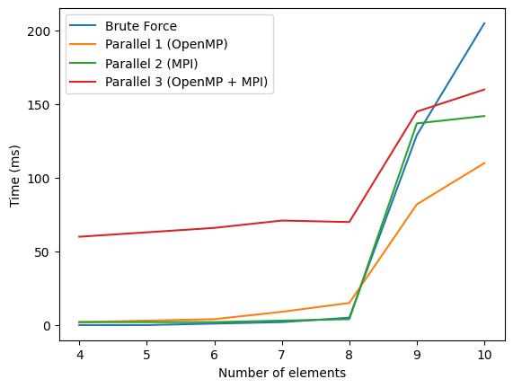
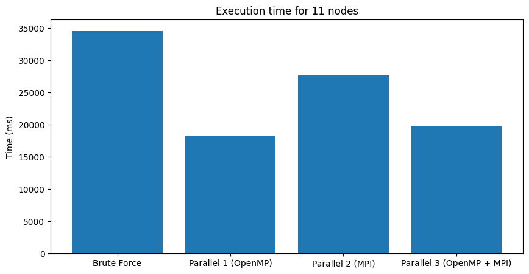

# Vehicle Routing Problem (VRP) Solver

## Introdução

O problema de roteamento de veículos (VRP) é fundamental em logística e gestão da cadeia de suprimentos, onde a eficiência nas rotas de entrega pode resultar em economias significativas de tempo e custos, além de redução do impacto ambiental. Este projeto aborda o VRP, um problema de otimização combinatória que visa minimizar o custo total das rotas de uma frota de veículos ao atender às demandas de diversos clientes. O objetivo é encontrar as rotas mais eficientes, considerando restrições como a capacidade dos veículos e a demanda dos clientes, usando técnicas de computação paralela para lidar com a complexidade do problema.

## Execução do Projeto

Para executar o projeto, é necessário ter o compilador de C++ instalado na máquina. O comando para executar o código compilado é:
    
### Brute Force
```bash
./brute_foce data/<data_file> 
```

### Solução Aproximada (Local Search)
```bash
./local_search data/<data_file> 
```
### Parallel Solution 1 (OpenMP)
```bash
./parallel_1 data/<data_file> 
```
### Parallel Solution 2 (MPI)
```bash
mpirun -np 2 ./parallel_2 data/<data_file> 
```

### Parallel Solution 3 (OpenMP + MPI)
```bash
mpirun -np 2 ./parallel_3 data/<data_file> 
```

Obs.: O número máximo de paradas está configurado direto no código e o default é 10.

## Solução de Força Bruta

### Descrição da Solução

A abordagem de força bruta para resolver o VRP implementada neste projeto segue os seguintes passos:

1. **Geração de Rotas Possíveis:** Utiliza-se um algoritmo de busca em largura (Breadth-First Search, BFS) para explorar todas as possíveis rotas que podem ser formadas a partir do ponto de partida. Cada rota é construída incrementalmente, verificando todas as conexões possíveis a partir de cada nó.

2. **Geração do Conjunto de Potência (Power Set):** Após a geração de todas as rotas possíveis, criamos um conjunto de potência dessas rotas. O conjunto de potência contém todos os subconjuntos possíveis de rotas, permitindo a combinação de diferentes rotas para formar soluções abrangentes.

3. **Seleção de Rotas:** Dentro do conjunto de potência, seleciona-se o subconjunto que apresenta o menor custo total, desde que esse subconjunto respeite as restrições de demanda do problema. Isso envolve verificar se a capacidade total transportada em cada rota do subconjunto não excede a demanda requerida pelos clientes.

### Limitações

A solução de força bruta é computacionalmente intensiva e torna-se impraticável para instâncias maiores do problema, dado que o número de subconjuntos cresce exponencialmente com o número de rotas possíveis.

## Solução Aproximada

### Descrição da Solução

Para uma solução mais eficiente, foi adotada uma abordagem aproximada:

1. **Geração de Rotas com BFS Modificado:** O algoritmo de BFS foi ajustado para priorizar a expansão dos nós que atendem os clientes com maior demanda. Esse critério busca maximizar a satisfação das demandas maiores mais rapidamente, potencialmente reduzindo o número total de rotas necessárias.

2. **Geração do Conjunto de Potência e Seleção de Rotas:** Semelhante à abordagem de força bruta, geramos o conjunto de potência das rotas e selecionamos o subconjunto de menor custo que respeita as restrições de demanda.

### Implementação Paralela (Versão 1 - OpenMP)

Para melhorar o desempenho da solução aproximada, foi implementada uma versão paralela da função `find_best_route_parallel`. A diretiva `#pragma omp parallel` é utilizada para criar uma região paralela, onde várias threads podem executar o loop `for` em paralelo. A variável `local_min_cost` é inicializada com o valor máximo inteiro (`INT_MAX`) para cada thread, e a redução é utilizada para encontrar a rota global com o menor custo.

```cpp
std::vector<Path> find_best_route_parallel(const std::vector<std::vector<Path>>& power_set, const Edges& edges, const Demand& demanda) {
    int min_cost = INT_MAX;  // Use o valor máximo inicial para min_cost
    std::vector<Path> best_route;
    std::vector<Path> local_best_route;
    int local_min_cost;

    #pragma omp parallel private(local_best_route, local_min_cost)
    {
        local_min_cost = INT_MAX; // Inicialize local_min_cost para o máximo para cada thread

        #pragma omp for nowait
        for (size_t i = 0; i < power_set.size(); ++i) {
            const auto& combination = power_set[i];
            if (check_combination_demand(combination, demanda)) {
                int cost = total_cost_of_combination(combination, edges);
                if (cost < local_min_cost) {
                    local_min_cost = cost;
                    local_best_route = combination;
                }
            }
        }

        // Redução para encontrar a rota global com menor custo
        #pragma omp critical
        {
            if (local_min_cost < min_cost) {
                min_cost = local_min_cost;
                best_route = local_best_route;
            }
        }
    }

    return best_route;
}
```

#### Benefícios da Paralelização 1
- Redução de Tempo: A paralelização pode significativamente acelerar a busca pela melhor rota, especialmente quando o conjunto de dados é grande e a carga de trabalho pode ser distribuída efetivamente entre várias threads.

- Eficiência de Recursos: Utilizar múltiplas threads pode ajudar a utilizar mais completamente os recursos da CPU, melhorando a eficiência geral do sistema.
Considerações Técnicas

- Escalonamento e Concorrência: A eficácia da paralelização depende de como as tarefas são escalonadas e da capacidade do hardware. Em alguns casos, pode haver um aumento no overhead devido à gestão de threads e sincronização, o que pode reduzir os ganhos de desempenho.

- Gerenciamento de Memória: Cada thread possui sua própria cópia de variáveis locais, e o uso eficiente da memória pode se tornar um fator crítico, especialmente com grandes volumes de dados.

### Vantagens
Esta abordagem aproximada tende a ser mais rápida que a solução de força bruta, reduzindo o número de rotas e subconjuntos a considerar, devido à priorização inicial das demandas maiores.Porém, não é garantido que a solução gerada será a ótima global, mas sim uma solução próxima ao ótimo.

### Implementação Paralela (Versão 2 - MPI)

Para melhorar ainda mais o desempenho da solução aproximada, foi implementada uma versão paralela da função `find_best_route` utilizando a biblioteca MPI (Message Passing Interface). Nesta abordagem, os processos MPI são utilizados para distribuir a carga de trabalho entre diferentes nós de um cluster de computadores, permitindo a execução paralela em um ambiente distribuído.

```cpp
std::vector<Path> find_best_route(const std::vector<std::vector<Path>>& power_set, const Edges& edges, const Demand& demanda, int argc, char** argv, int size, int rank) {
    
    int total_power_set_size = power_set.size();
    int chunk_size = total_power_set_size / size;
    int remainder = total_power_set_size % size;
    int padding = size - remainder;
    int num_elements_per_process = (total_power_set_size + padding) / size;
    int min_cost = 99999999;
    int idx_start = rank * num_elements_per_process;
    int idx_end = (rank + 1) * num_elements_per_process;
    if (rank == size - 1) {
        idx_end = total_power_set_size;
    }

    std::vector<int> idx_best_route(1);
    idx_best_route[0] = -1;
    
    for (int i = idx_start; i < idx_end; i += 1) {
        const auto& combination = power_set[i];
        if (check_combination_demand(combination, demanda)) {
            // std::cout << "Entrei no IF " << std::endl;
            int cost = total_cost_of_combination(combination, edges);
            // std::cout << "Custo: " << cost << std::endl;
            if (cost < min_cost) {
                min_cost = cost;
                idx_best_route[0] = i;
            }
        }
    }


    // manda os melhores indices para o rank 0
    std::vector<int> best_routes(size);
    MPI_Gather(idx_best_route.data(), 1, MPI_INT, best_routes.data(), 1, MPI_INT, 0, MPI_COMM_WORLD);

    // pega o melhor indice
    int best_idx = -1;
    int best_cost = 99999999;
    if (rank == 0) {
        for (int i = 0; i < size; i += 1) {
            if (best_routes[i] != -1) {
                const auto& combination = power_set[best_routes[i]];
                int cost = total_cost_of_combination(combination, edges);
                if (cost < best_cost) {
                    best_cost = cost;
                    best_idx = best_routes[i];
                }
            }
        }
    }

    std::vector<Path> best_route;
    if (rank == 0) {
        best_route = power_set[best_idx];
    }
    return best_route;
}
```

#### Benefícios da Paralelização 2
- Escalabilidade: A paralelização com MPI permite a execução em um cluster de computadores, distribuindo a carga de trabalho entre diferentes nós. Isso pode melhorar significativamente o desempenho ao lidar com grandes volumes de dados e problemas complexos.

- Tolerância a Falhas: A execução distribuída com MPI pode fornecer tolerância a falhas, permitindo que o sistema continue funcionando mesmo se um dos nós falhar.

- Flexibilidade: A abordagem MPI é altamente flexível e pode ser adaptada para diferentes configurações de hardware e requisitos de desempenho.

### Vantagens

A abordagem MPI oferece uma escalabilidade significativa, permitindo a execução paralela em um cluster de computadores. Isso pode ser particularmente útil para problemas de grande escala que exigem uma quantidade significativa de recursos computacionais.

###  Implementação Paralela (Versão 3 - OpenMP + MPI)

Para combinar os benefícios da paralelização com OpenMP e MPI, foi implementada uma versão híbrida da função `find_best_route` que utiliza ambas as abordagens. Nesta implementação, a paralelização com OpenMP é utilizada dentro de cada processo MPI para explorar a busca da melhor rota de forma paralela em cada nó do cluster.

```cpp
std::vector<Path> find_best_route(const std::vector<std::vector<Path>>& power_set, const Edges& edges, const Demand& demanda, int argc, char** argv, int size, int rank) {
    
    int total_power_set_size = power_set.size();
    int chunk_size = total_power_set_size / size;
    int remainder = total_power_set_size % size;
    int padding = size - remainder;
    int num_elements_per_process = (total_power_set_size + padding) / size;
    int min_cost = 99999999;
    int idx_start = rank * num_elements_per_process;
    int idx_end = (rank + 1) * num_elements_per_process;
    if (rank == size - 1) {
        idx_end = total_power_set_size;
    }

    std::vector<int> idx_best_route(1);
    idx_best_route[0] = -1;
    #pragma omp parallel for
    for (int i = idx_start; i < idx_end; i += 1) {
        const auto& combination = power_set[i];
        if (check_combination_demand(combination, demanda)) {
            // std::cout << "Entrei no IF " << std::endl;
            int cost = total_cost_of_combination(combination, edges);
            // std::cout << "Custo: " << cost << std::endl;
            if (cost < min_cost) {
                min_cost = cost;
                idx_best_route[0] = i;
            }
        }
    }

    // manda os melhores indices para o rank 0
    std::vector<int> best_routes(size);
    MPI_Gather(idx_best_route.data(), 1, MPI_INT, best_routes.data(), 1, MPI_INT, 0, MPI_COMM_WORLD);

    // pega o melhor indice
    int best_idx = -1;
    int best_cost = 99999999;
    if (rank == 0) {
        for (int i = 0; i < size; i += 1) {
            if (best_routes[i] != -1) {
                const auto& combination = power_set[best_routes[i]];
                int cost = total_cost_of_combination(combination, edges);
                if (cost < best_cost) {
                    best_cost = cost;
                    best_idx = best_routes[i];
                }
            }
        }
    }

    std::vector<Path> best_route;
    if (rank == 0) {
        best_route = power_set[best_idx];
    }
    return best_route;
}
```

#### Benefícios da Paralelização 3

- Combinando OpenMP e MPI: A abordagem híbrida combina os benefícios da paralelização com OpenMP e MPI, permitindo a execução paralela em cada nó do cluster e a distribuição da carga de trabalho entre os nós.

- Desempenho e Escalabilidade: A combinação de OpenMP e MPI pode melhorar significativamente o desempenho e a escalabilidade, permitindo a execução eficiente em um ambiente distribuído com múltiplos nós e threads.

- Flexibilidade e Adaptabilidade: A abordagem híbrida oferece flexibilidade e adaptabilidade para lidar com diferentes requisitos de desempenho e configurações de hardware, permitindo uma otimização eficaz do sistema.

### Vantagens

A abordagem híbrida OpenMP + MPI combina os benefícios da paralelização em nível de thread e em nível de processo, proporcionando um desempenho otimizado e escalabilidade em um ambiente distribuído. Isso pode ser particularmente útil para problemas de grande escala que exigem uma execução eficiente em um cluster de computadores.

## Conclusão

Por fim, vamos fazer um comparativo do tempo de execução das diferentes abordagens implementadas para resolver o VRP, considerando instâncias de diferentes tamanhos. Para isso, utilizaremos um conjunto de dados de teste presente na pasta `data/` do projeto. O tempo de execução será medido em ms (milissegundos) e comparado entre as soluções de força bruta, solução aproximada com OpenMP, solução aproximada com MPI e solução híbrida OpenMP + MPI. Acompanhe os gráficos abaixo:




